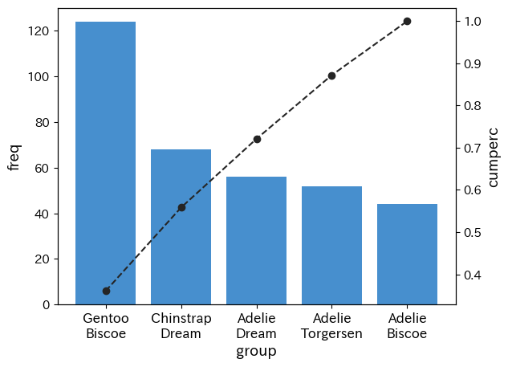

# `py4stats.Pareto_plot()`: パレート図の作成

## 概要

データフレームからパレート図を作図する関数です。

``` python
Pareto_plot(
    data: IntoFrameT,
    group: str,
    values: Optional[str] = None,
    top_n: Optional[int] = None,
    aggfunc: Callable[..., Any] = np.mean,
    ax: Optional[Axes] = None,
    fontsize: int = 12,
    xlab_rotation: Union[int, float] = 0,
    palette: Sequence[str] = ("#478FCE", "#252525"),
    )
``` 

- `data`：**IntoFrameT**（必須）<br>
  入力データ。narwhals が受け入れ可能な DataFrame 互換オブジェクト<br>
  （例：`pandas.DataFrame`、`polars.DataFrame`、`pyarrow.Table`）を指定できます。
- `group`：**str**</br>
　集計に使用するデータフレームの列名（必須）。
- `values`：**str**</br>
　集計に使用するデータフレームの列名。`values = None`（初期設定）の場合、`group` 別の度数が表示され、`values` が指定された場合、`group` 別に `values` を `aggfunc`で集計した値がグラフに表示されます。
- `top_n`：**int**</br>
　棒グラフを表示するカテゴリーの件数。`top_n = None`（初期設定）の場合、すべてのカテゴリーを表示し、整数値が指定された場合、上位 `top_n` 件が表示されます。
- `aggfunc`：**callable**</br>
    `values` が指定された際に、集計に使用する集計関数。`np.mean` など `values` 列を1次元配列として受け取って単一の数値を返す任意の関数が使用できるほか、`nw.mean` など narwhals.functions モジュールで実装された関数を使用できます。
- `ax`</br>
描画先となる matplotlib の Axes。複数のグラフを並べる場合などに使用します。デフォルトの `None` の場合は、新しい Figure と Axes が作成されます。
- `fontsize`：**int**</br>
　軸ラベルなどのフォントサイズ。
- `xlab_rotation`：**int or float**</br>
    横軸ラベルの角度。matplotlib の `ax.xaxis.set_tick_params()` に引数 `rotation` として渡されます。
- `palette`：**list of str**</br>
    グラフの描画に使用する色コード。1つ目の要素が棒グラフの色に、2つ目の累積値を表す折線グラフの色に対応します。

## 使用例

``` python
import py4stats as py4st
import pandas as pd
import numpy as np
from palmerpenguins import load_penguins
penguins = load_penguins() # サンプルデータの読み込

penguins['group'] = penguins['species'] + '\n' + penguins['island']

py4st.Pareto_plot(penguins, group = 'group')
```



``` python
py4st.Pareto_plot(
    penguins, group = 'group', 
    values = 'bill_length_mm',
    aggfunc = np.mean,
    palette = ['#FF6F91', '#252525']
    )
``` 


``` python
py4st.Pareto_plot(
    penguins, 
    values = 'bill_length_mm',
    group = 'group',
    aggfunc = lambda x: x.std()
    )
``` 


***
[Return to **Function reference**.](../reference.md)
