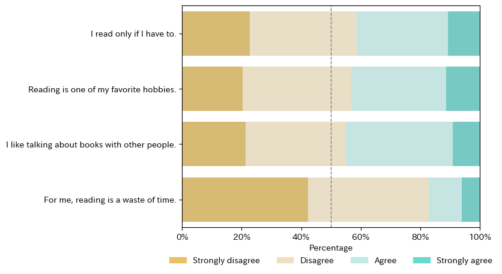
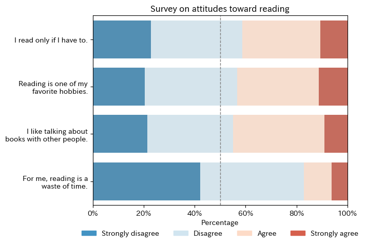

# `py4stats.plot_category()`

カテゴリ変数の回答分布を 100% 積み上げ横棒グラフとして描画します。

## 概要

本関数は、複数のカテゴリ変数について回答分布を集計し、各変数を1本の100%積み上げ横棒グラフとして可視化します。リッカート尺度による設問や、共通のカテゴリをもつ、アンケートの回答データの可視化を主な用途としています。

``` python
plot_category(
    data: IntoFrameT,
    palette: Optional[sns.palettes._ColorPalette] = None,
    legend_type: Literal['horizontal', 'vertical', 'none'] = 'horizontal',
    show_vline: bool = True,
    ax: Optional[Axes] = None,
):
``` 

## 引数 Argument

- `data`：**IntoFrameT**（必須）<br>
    カテゴリ変数を含む入力データフレーム（1列につき1変数）。 `narwhals` がサポートする任意のデータフレーム型（`例：pandas.DataFrame`、`polars.DataFrame`）を指定できます。
    すべての列は、同一のカテゴリ体系（共通のカテゴリラベル）を共有している必要があります。
    **注意**：`pyarrow.Table` については、その仕様による機能制限があります。詳細は「注意 Notes」セクションを参照してください。
- `sort_by`: **str**<br>
    回答カテゴリの並び順を決定する基準。`'values'`：カテゴリの値（ラベル）でソートします。`'frequency'`：出現頻度の高い順にソートします。デフォルトは `'values'` です。
- `palette` **sns.palettes._ColorPalette**:<br>
    回答カテゴリに使用するカラーパレット。
    `None` の場合は、内部でデフォルトの発散型パレットを生成します。
    指定する場合は、カテゴリ数と同じ長さの配列である必要があります。
    デフォルトは `None` です。
- `legend_type`**str**:<br>
    凡例の配置方法。デフォルトは `'horizontal'` です。
    - `'horizontal'`：凡例をグラフ下部に横並びで表示します。
    - `'vertical'`：凡例をグラフ右側に縦並びで表示します。
    - `'none'`：凡例を表示しません。
- `show_vline`:**bool**<br>
    `True` の場合、x = 0.5（50%）の位置に基準となる垂直線を描画します。
    割合の中点を視覚的に示す目的で使用できます。デフォルトは `True` です。
- `ax`:<br>
    描画先となる matplotlib の Axes。複数のグラフを並べる場合などに使用します。デフォルトの `None` の場合は、新しい Figure と Axes が作成されます。

## 使用例 Example

```python
import py4stats as py4st
import pandas as pd
import itertools

Q1 = [70 * ['Strongly agree'], 200 * ['Agree'], 235 * ['Disagree'], 149 * ['Strongly disagree']]
Q2 = [74 * ['Strongly agree'], 209 * ['Agree'], 238 * ['Disagree'], 133 * ['Strongly disagree']]
Q3 = [59 * ['Strongly agree'], 235 * ['Agree'], 220 * ['Disagree'], 140 * ['Strongly disagree']]
Q4 = [40 * ['Strongly agree'], 72 * ['Agree'], 266 * ['Disagree'], 276 * ['Strongly disagree']]

data = pd.DataFrame({
    'I read only if I have to.':list(itertools.chain.from_iterable(Q1)),
    'Reading is one of my favorite hobbies.':list(itertools.chain.from_iterable(Q2)),
    'I like talking about books with other people.':list(itertools.chain.from_iterable(Q3)),
    'For me, reading is a waste of time.':list(itertools.chain.from_iterable(Q4))
})
```

```python
categ_list = ['Strongly disagree', 'Disagree', 'Agree', 'Strongly agree']

data_pd = data.apply(pd.Categorical, categories = categ_list)

py4st.plot_category(data_pd)
```



```python
import polars as pl
import textwrap

data_pl = pl.from_pandas(data)
data_pl = data_pl.with_columns(
        pl.all().cast(pl.Enum(categ_list))
    )\
    .rename(lambda x: textwrap.fill(x, width = 25))

fig, ax = plt.subplots()

py4st.plot_category(
    data_pl, 
    palette = sns.color_palette('RdBu', n_colors = 4),
    ax = ax
    )

ax.set_title('Survey on attitudes toward reading');
```



## 注意 Notes

- `sort_by="values"` は、カテゴリの順序情報（例：`pandas` の `ordered categorical`、`Polars` の `Enum` で定義した順序）を前提に、カテゴリ順で描画します。
- **推奨**： sort_by="values" を利用する場合は、入力として `pandas.DataFrame`（各列を `pd.Categorical` に設定）または `polars.DataFrame`（各列を `Enum` に設定）を推奨します。 
- `polars.Categorical` の列では、カテゴリ順が期待通りに保持されず、辞書順（例：Agree, Disagree, …）で描画される場合があります。
- `pyarrow.Table` を入力した場合、`sort_by = 'values’` は `dictionary` 型の制約によりエラーとなる場合があります。その場合は `sort_by="frequency"` を使用してください。 