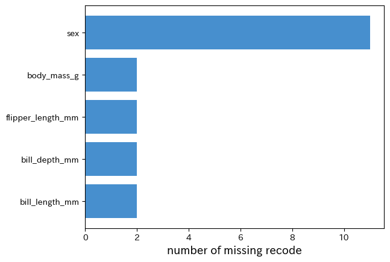

# `py4stats.plot_miss_var()`

## 概要

R言語の [`naniar::gg_miss_var()`](https://naniar.njtierney.com/reference/gg_miss_var.html) をオマージュした関数で、DataFrameの各変数について欠測値の量を横棒グラフとして可視化します。欠損値統計の計算には [`py4stats.diagnose()`](diagnose.md) を使用しています。

``` python
plot_miss_var(
    data: IntoFrameT,
    values: Literal['missing_percent', 'missing_count'] = 'missing_percent', 
    sort: bool = True, 
    miss_only: bool = False, 
    top_n: Optional[int] = None,
    fontsize: int = 12,
    ax: Optional[Axes] = None,
    color: str = '#478FCE',
    **kwargs: Any
)
``` 

## 引数 Argument

- `data`：**IntoFrameT**（必須）<br>
  入力データ。narwhals が受け入れ可能な DataFrame 互換オブジェクト<br>
  （例：`pandas.DataFrame`、`polars.DataFrame`、`pyarrow.Table`）を指定できます。
- `normalize`：**str**</br>
　グラフに表示する値の種類。
    - `missing_percent` 列毎の欠測率をパーセンテージで表示します。
    - `columns` 列毎の欠測数を表示します。
- `sort`：**bool**</br>
    プロット前に選択した指標で列をソートするかどうか。初期設定は True です。。
- `miss_only`：**bool**</br>
    欠測値を含まない列を除外するかどうか。True だと欠測値を含まない列を除外し、False（初期設定）だと省略せずに全ての列を表示します。
- `top_n`：**int**</br>
    棒グラフを表示するグラフの個数。`top_n = None`（初期設定）の場合、すべての棒グラフを表示し、整数値が指定された場合、欠測率（数）の上位 `top_n` 件が表示されます。
- `ax`</br>
　matplotlib の ax オブジェクト。複数のグラフを並べる場合などに使用します。
- `fontsize`：**int**</br>
　軸ラベルなどのフォントサイズ。
- `palette`：**list of str**</br>
　グラフの描画に使用する色コード。棒グラフの色に対応します。

## 使用例 Example

``` python
import py4stats as py4st
import pandas as pd
from palmerpenguins import load_penguins
penguins = load_penguins() # サンプルデータの読み込

py4st.plot_miss_var(penguins)
```


``` python
py4st.plot_miss_var(penguins, values = 'missing_count', miss_only = True)
``` 


***
[Return to **Function reference**.](../reference.md)
